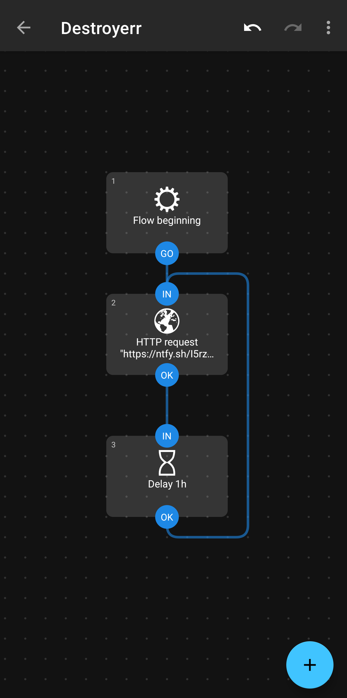

# Destroyerr

Keeping integrity for mission-critical systems.

Destroyerr is a tool that allows you to automatically run commands when a device has not contacted the server for a specified amount of time. Using [ntfy.sh](https://ntfy.sh), you can send keep-alive messages from any device to the server. Once the device stops sending these messages, Destroyerr will execute a command to shut down the device, or destroy it, or any other action you specify.

This ensures the integrity of your systems by preventing devices from being left in an unknown state.

**This readme contains a whole tutorial on how to set up Destroyerr using _Docker_, _ntfy_, and _Automate_ on Android**

## Tutorial

To keep the server alive, you need to send a ntfy message with `title: destroyerr` and `message: keep-alive` to the ntfy server.

### Set up Docker

Set up destroyerr using Docker. This tutorial assumes you have Docker installed on your system.
Pass the following environment variables to the Docker container:

- `NTFY_URL`: The URL of your ntfy server, including the topic, **and a `/sse` suffix**. For example, `https://ntfy.sh/your-topic/sse`.
- `SH_COMMAND`: What command to run once the timeout is reached. For example, `shutdown now` to shut down the device.
- `DESTROY_TIMEOUT`: The timeout in seconds after which the command will be executed. For example, `3600` for one hour.
- `CHECK_INTERVAL` (advanced): The interval in seconds at which the server will check for devices that have not sent a keep-alive message. For example, `60` for one minute.

Here's an example `docker-compose.yaml` file to get you started:

```yaml
services:
  destroyerr:
    container_name: destroyerr
    image: myzel394/destroyerr
    environment:
      NTFY_URL: https://ntfy.sh/I5rzgNidrnKngf/sse
      CHECK_INTERVAL: 10
      DESTROY_TIMEOUT: 60
      SH_COMMAND: "curl -d '[DESTROYERR] Device has not pinged since 60 seconds!' https://ntfy.sh/ojuzhnHdzudfn"
````

This will send a notification to the topic `ojuzhnHdzudfn` when the device has not pinged for 60 seconds, checking every 10 seconds.

### Set up your Android phone as a pinger

This setup uses [Automate](https://play.google.com/store/apps/details?id=com.llamalab.automate) to send the keep-alive messages. This app is free, but not open-source.

1. Install [Automate](https://play.google.com/store/apps/details?id=com.llamalab.automate)
2. Create a new flow with the following blocks:
  - **HTTP Request**: Set the URL to your ntfy server URL, including the topic and `/sse` suffix. For example, `https://ntfy.sh/your-topic/sse`.
    - Method: POST
    - Headers: `title: destroyerr`
    - Body: `keep-alive`
  - **Delay**: Set the delay to the interval you want to send the keep-alive message (e.g., 60 seconds).
  - **Loop**: Connect the output of the Delay block to the input of the HTTP Request block to create a loop that sends the keep-alive message at the specified interval.
3. Save and run the flow.

Your flow should look something like this:


<p align="center">
    
</p>

4. Start the workflow, and your phone will now send keep-alive messages to the ntfy server at the specified interval

